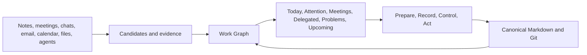

# PM Forge

**A local-first Work Graph Assistant for controlling work, commitments, meetings, and evidence.**

PM Forge turns fragmented activity from notes, meetings, conversations, calendars, email, issue trackers, files, and agents into one evidence-backed graph of work.

Tasks and projects are different zoom levels of the same recursive Work concept. Every work item can be connected to actors, organizations, commitments, problems, results, source evidence, and related context.

## Why PM Forge

Important work is rarely contained in one task list. A commitment may begin in a meeting, gain context in chat, depend on a file, conflict with a calendar event, and require follow-up from either a person or an agent. Manually maintaining all those connections does not scale.

PM Forge is designed to help one operator:

- collect candidate work and evidence from many sources;
- see tasks, projects, commitments, problems, and results in one model;
- prepare context and relevant files for meetings and conversations;
- control both personal work and work delegated to people or agents;
- notice overdue controls, missing evidence, and conflicting information;
- keep every important conclusion traceable to its source;
- approve canonical changes and external actions before they happen.

## Current status

PM Forge is in private daily-driver alpha. The current implementation includes:

- daily, attention, candidate, meeting, delegated, problem, and upcoming perspectives;
- recursive Work Nodes for tasks and projects;
- evidence and provenance connected to work;
- detection and review of explicit assignments and commitments;
- meeting preparation and task-specific memo workflows;
- control of personal and delegated commitments;
- visibility of overdue controls and conflicting evidence;
- deterministic previews for approval-gated actions;
- canonical Markdown and Git as the portable source of truth.

The implementation is being tested privately before a source release. This public repository currently publishes the product overview only.

## How it works

PM Forge does not treat a task as an isolated checkbox. It treats work as a graph of intent, responsibility, evidence, commitments, problems, and results.

The core graph contains:

- **Work Node** — intended work at task or project scale;
- **Actor** — a person or agent;
- **Organization** — a company or durable group;
- **Commitment** — an accepted promise or obligation;
- **Problem** — an accepted negative condition requiring control;
- **Result** — an evidenced outcome awaiting or carrying acceptance;
- **Evidence** — accepted support or contradiction;
- **Source** — the note, meeting, message, file, system, or agent activity behind evidence;
- **Candidate** — a proposition that has not yet been accepted as truth;
- **Relationship** — a typed, directional, provenance-bearing connection.

## Daily control

The Workbench projects the same graph through several perspectives:

- **Today** — the bounded daily control queue;
- **Attention** — overdue controls, conflicts, missing evidence, and pending acceptance;
- **Candidates** — detected work or relationships awaiting review;
- **Meetings** — preparation, memo, analysis, and reconciliation state;
- **Delegated** — work and commitments controlled through another actor;
- **Problems** — open problems and their mitigation context;
- **Upcoming** — accepted future work and commitment controls.

Each card explains why it appears and connects back to its evidence and context.

## Principles

- **Markdown and Git are authoritative.** Databases, indexes, memory, and UI materializations must be rebuildable.
- **Tasks and projects share one model.** Moving between detail and overview does not create a second identity.
- **Uncertainty remains visible.** Uncertain extraction creates a Candidate rather than accepted truth.
- **Conflicting evidence stays distinct.** PM Forge does not silently choose the most convenient version.
- **Assignment and Commitment are different.** Being assigned work does not prove that it was accepted.
- **A completion claim is not automatic acceptance.** Results remain inspectable until explicitly accepted.
- **Source access does not imply write authority.** Every adapter has a narrow, explicit capability boundary.
- **Automation proposes; the operator decides.** Canonical mutations and external messages require exact approval.
- **Private usefulness comes first.** Publication readiness is a safety boundary, not a reason to delay a useful personal tool.

## Product direction

PM Forge is intended to become a lightweight Markdown knowledge and work environment, reducing dependence on a separate editor for daily operation while preserving portable files and Git history.

The immediate sequence is:

1. Prove useful daily operation with private work and personal activity.
2. Stabilize capture, meeting processing, commitment control, reminders, and recovery.
3. Publish a sanitized implementation with documentation, fictional fixtures, and a clear contribution boundary.

Optional integrations and multi-user capabilities remain secondary to a reliable single-operator daily driver.

## Repository status

This repository is currently a public project preview. Source code, installation instructions, and contribution workflows have not been published yet.

Feedback on the product direction is welcome through GitHub Issues.

## License

No software license is granted yet because the implementation has not been published. A source-code license will be added with the first implementation release.
